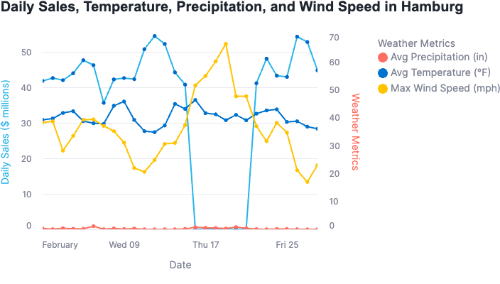

# Tastybytes Weather & Sales Insights

Interactive Data Visualization with **Snowflake** and **Streamlit**

## Project Overview
This project demonstrates an end-to-end data pipeline using the **Ingestion–Transformation–Delivery (I-T-D)** framework.  
The goal was to analyze weather conditions in Hamburg, Germany, and their impact on Tasty Bytes food truck sales.  

- **Ingestion**: Data loaded from Snowflake Marketplace and AWS S3  
- **Transformation**: SQL, views, and custom UDFs (e.g., Fahrenheit → Celsius, Inches → Millimeters)  
- **Delivery**: Interactive Streamlit app in Snowflake with Altair charts  

## Visualization
The final dashboard shows **daily sales vs. temperature, precipitation, and wind speed**.  
Here’s an example of the interactive chart built with Altair:  

## Conclusion
This project highlights how Snowflake can be used as a complete platform for data pipelines, transformations, and business insights delivery — all in one place.

https://app.snowflake.com/ssiqxgh/lfb12171/#/streamlit-apps/TASTY_BYTES.HARMONIZED.OP_OX1DP12O8T93G?ref=snowsight_shared
